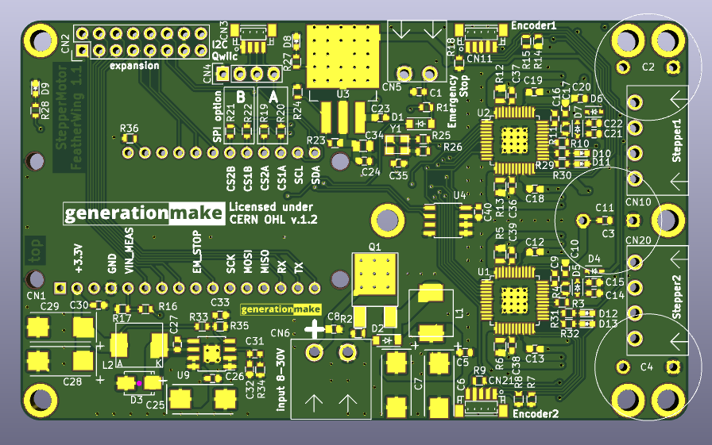
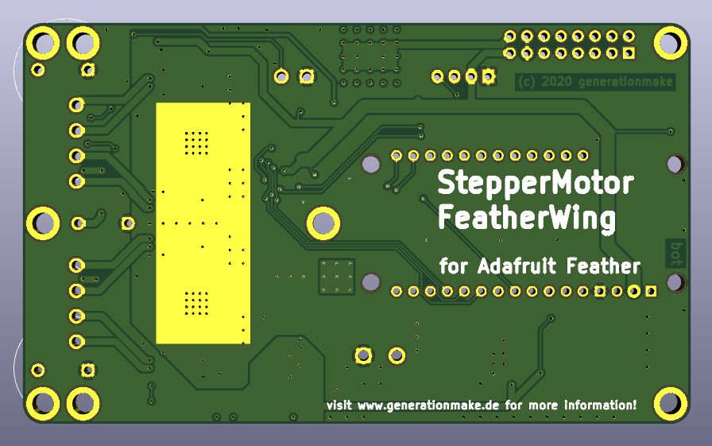

# StepperMotorFeatherWing
StepperMotorFeatherWing with Trinamic TMC5130A-TA drivers for two stepper motors compatible with Adafruit Feather 

## PCB

### Top

### Bottom

## License

This hardware is licensed under the CERN OHL v. 1.2

